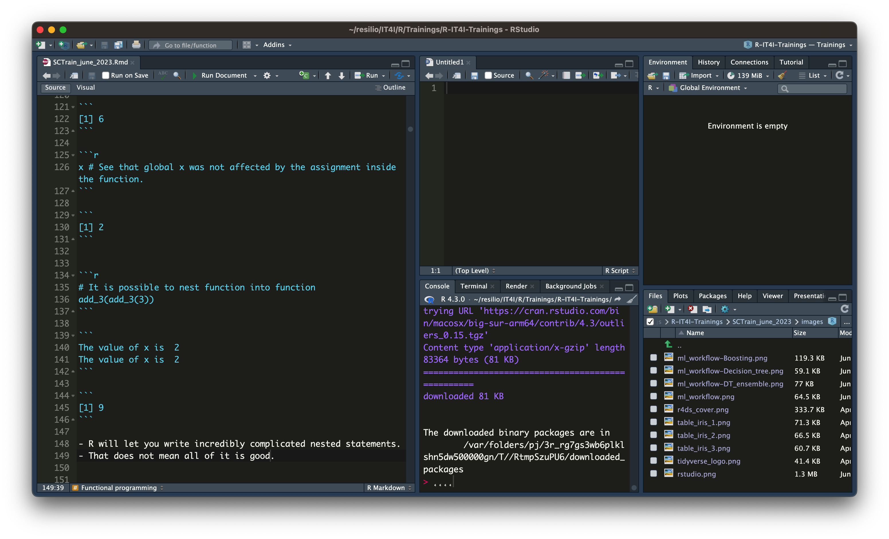
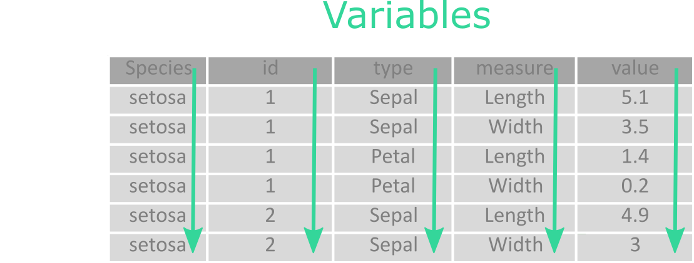
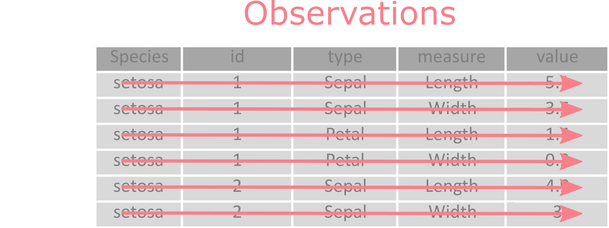
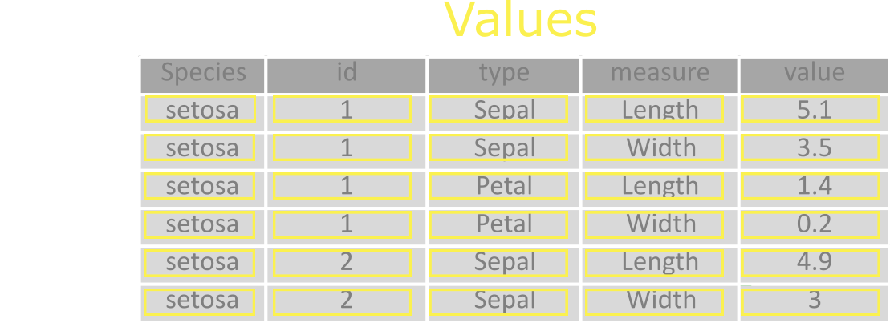

```{r setup, include=FALSE}
library(learnr)
library(naniar)
library(ggplot2)
library(dplyr)
data(airquality)
knitr::opts_chunk$set(echo = FALSE)
tutorial_options(exercise.completion = TRUE)

load("data/iris_tidy.Rdata")
```

## Introduction to R
Historically R is a statistical language based on S and was really mainly used for statistical analysis and statistical modelling.

At the moment, it has outgrown its original focus and it could be seen as a really mature scientific language able to cover wide range of different fields in scientific computing with tools making it possible to complete production solutions from data import to results presentation with web application or API at the end.
Of course some parts could be created more efficient or even easier with different programming language, but that means introducing another programming language into the solution and it depends on the project whether that is a viable and sustainable solution or not.

Some of the reasons to consider using R in the new projects are:

- Easy to learn and use, especially for people with no programming experience.
- Enormous amount of libraries from multiple fields.
- Tools for easy integration of C/C++, JavaScript, Python and other languages.
- Usually, base packages of R introduce few breaking changes.
- Readable syntax, especially when using [Tidyverse](https://tidyverse.tidyverse.org/).
- Great environment for complex and reproducible machine learning project with [Tidymodels](https://www.tidymodels.org).
- [RStudio IDE](https://posit.co/products/open-source/rstudio/).
- [Shiny](https://rstudio.github.io/shiny/) web applications.
- Possibility to create web API with [plumber](https://www.rplumber.io) library.
- Reproducible and automatic report generation with [R Markdown](https://rmarkdown.rstudio.com) documents.

RStudio is an open-source development environment for R developed by [Posit](https://posit.co).
It contains many integration for the quick, but still robust R code development.
One of the biggest differences in the workflow to classical programming is, that one can execute each line and check the current environment at any given time.
Such workflow can be used when working with [Matlab](https://www.mathworks.com/products/matlab.html).

Its main advantage is much quicker code development, however also it requires more discipline to make the working code.
Common mistake is saving and restoring the work environment between work session, what can easily lead to scripts which expect some variable, that was manually defined in previous sessions and is not defined anywhere in the script.

{.class width="100%"}

## Basic data types and structures

In R we have several basic classes of vectors:

- Logical - TRUE, FALSE
- Numeric - 123.4, 5345.4591
- Integer - 5L, 532L, 0L
- Complex - 5 + 3i
- Character - "OK", 'test'
- Raw - binary format, `charToRaw("Test")`

To create a vector in R a function `c()` is used.
Assigning an expresion to a variable is done using `<-` instead of `=` as is used in most of the programming languages.
It pretty much concatenate multiple values into one vector.

Let's take a look at some of these:
```{r data_types, exercise = TRUE}
index <- c(TRUE, FALSE, TRUE)

class(index)
```

Upon these most of the other data structures in R are built.

Another set of basic data structures in R are:

#### Lists
List are object which may contain different data types as each element of the list.
Elements of list could be vectors, functions, another lists, or pretty much any other object.
It is the most flexible data structure in R.

#### Matrices
The matrix is a data structure  which contains one data type and has two dimension.

#### Arrays
Array is similar to matrix, but instead of being two-dimensional, it is n-dimensional object.

#### Factors
Factors are defining qualitative variables with limited set of values.
Unique values of factors are also called levels.
This special data structure is mostly used for statistical analysis and is sometimes helpful also for the visualization.

#### Data Frames
Data frame is the most used structure for data analysis in R.
It is similar to matrix in a way, that it has two dimensions, but each column of data frame can contain a different data type.
In context of Tidyverse an extended version of data frame, called tibble, is used, which allows to have a list of lists which greatly enhance the possibilities, but also increases the abstraction needed to work with such data structures.

Now we will take a look at these objects in interactive window:

```{r data_structures, exercise = TRUE}
test <- list("a", c(1, 5, 6, 2), data.frame(day = 1:5, value = c(3,4,5,1,3)))

print(test)
```

When using R You may encounter also notion of object-oriented programming and related object types, however that is way beyond the scope of this training.
Interested people may read more about this in Hadley's [Advanced R](https://adv-r.hadley.nz) chapter [Base Types](https://adv-r.hadley.nz/base-types.html).

## Functional programming characteristics

R is a statistical programming language that falls into the category of functional programming.
As the name suggest this it is heavily centered around the function definitions and calling the function to get results.
Actually, there are ways to work in R that resembles more of a object oriented programming and it has its place, but for the sake of simplicity we will focus on the basics in this training.

Some characteristics of R are that:

- Data are immutable.
- It is easy to use and learn (for non-programmers).
- Great flexibility.
- Large user base.
- Enormous number of packages available in different fields.
- Can be slow and memory inefficient (but many function are actually written in C/C++).
- No direct memory control - garbage collector.


```{r, echo = TRUE}
# Comments are written with "#"
mtcars <- as.data.frame(mtcars) # we can assign an object with "<-" not "=" as you might be used to
mtcars # writing only the variable will do  default action for it, usually print() or equivalent
```

- tbl_mtcars is a tibble, which is special format of data.frame
- tibbles are basic object in which are stored data in R
- it is a special list which contains object with equal length
- each column may have different class

```{r, echo = TRUE}
x <- 2  # 2 is assigned to x
add_3 <- function(y){
  cat( "The value of x is ", x, "\n") # It will print x from global environment
  x <- 3   # The x is defined inside the function, this does not affect x in global environment
  y + x    # Local x is added to y
}
add_3(3) 

x # See that global x was not affected by the assignment inside the function.
```

```{r, echo = TRUE}
# It is possible to nest function into function
add_3(add_3(3))
```

- R will let you write incredibly complicated nested statements.
- That does not mean all of it is good.


## Classical R workflow example


## [{#id .class width="100"}](https://tidyverse.tidyverse.org/) Tidyverse

-   Family of R packages created for data science.
-   Designed to work together to make common data science operations more user friendly.
-   Packages have the same design philosophy, grammar, and data structures.
-   R for data science

[{.class width="100"}](https://r4ds.hadley.nz/)

## What we mean by tidy datasets

-   Consistent data structure, easy to manipulate, model and visualize.
-   Designed to minimize effort on cleaning data to get it ready for analysis.
-   Data tidying = data conversion into tidy form.

Let's look at the following well known iris dataset, you can start by clicking **"Run"** in the interactive window below.

```{r iris, exercise = TRUE}
head(datasets::iris)
```


It's tidy form looks like this:

```{r iris_tidy, exercise = TRUE}
head(iris.tidy)
```


## Tidy data definition

### There are three interconnected rules that define tidy dataset:

1.  Each <mark style="background-color: #92D6BD">variable</mark> is a <mark style="background-color: #92D6BD">column</mark>; each column is a variable.

{.class width="500"}

2.  Each <mark style="background-color: #F7B0B6">observation</mark> is a <mark style="background-color: #F7B0B6">row</mark>; each row is an observation.

{.class width="500"}

3.  Each <mark style="background-color: #FBF595">value</mark> is a <mark style="background-color: #FBF595">cell</mark>; each cell is a single value.

{.class width="500"}


## Why it is useful to have tidy data

There are two main reasons to invest time and energy to convert data into tidy format:

1. Tidy format is used all across the tidyverse universe. This consistency makes it easier to manage the tools that work with the data. 
After that, it is possible to spend more time on data analysis itself, than fighting with the tools.

2. Tidy format is particularly well suited for vectorised programming languages like R, where most built-in functions work with vectors of values.

## How to tidy messy datasets

From the tidy data definition, it may seem that the requirements for the given format are completely natural and that most of the data, that you will come into contact with in data analysis, will be in such format. But the reality is quite often different. In general, there may be several problems: data is often collected for some other purpose than data analysis and their structure is based on the requirement that their collection (and not analysis) should be as simple as possible or that the most people in real world are not familiar with the principle of tidy data and therefore the tidy format will not be their first choice (or second).

This means that any analysis will require at least some initial effort to transform the original "messy" data to tidy format. The most used operation here will be the [pivoting](https://tidyr.tidyverse.org/articles/pivot.html).

### Lengthening data

Lets take a look at the previously mentioned famous iris dataset:  

```{r iris3, exercise = TRUE}
head(iris)
```
Here, each observation describes a flower. The first four columns it's sepal length and width and petal length and width, the last column than it's species. The first four column names in this dataset contain two variables:  leaf type (with values sepal and petal) and leaf measure (with values length and width).

The key to transform this dataset to it's tidy form is the function [`tidyr::pivot_longer()`](https://tidyr.tidyverse.org/reference/pivot_longer.html):

```{r pivotlonger, exercise = TRUE}
iris.tidy <- iris |> 
  dplyr::mutate(id = 1:nrow(iris))
```

```{r pivotlonger-hint-1}
iris.tidy <- iris |> 
  dplyr::mutate(id = 1:nrow(iris)) |> 
  tidyr::pivot_longer(cols = 1:4)
```

```{r pivotlonger-solution}
iris.tidy <- iris |> 
  dplyr::mutate(id = 1:nrow(iris)) |> 
  tidyr::pivot_longer(cols = 1:4) |>
  tidyr::separate(col = "name",
                  into = c("type", "measure"))
head(iris.tidy)
```

The function [`dplyr::mutate()`](https://dplyr.tidyverse.org/reference/mutate.html) is used here to assign a unique identifier to individual flowers and the function [`tidyr::separate()`](https://tidyr.tidyverse.org/reference/separate.html) to split the variables type and measure.

What would happen if you forgot to use `separate` function ?


```{r pivotlonger2, exercise = TRUE}

```

### Widening data

The second commonly used function for data tidying is [`tidyr::pivot_wider()`](https://tidyr.tidyverse.org/reference/pivot_wider.html). It is the inverse transformation to `pivot_longer()`, it "widens" the data by increasing the number of columns and decreasing the number of rows.

```{r pivotwider, exercise = TRUE}
iris.tidy |> 
tidyr::pivot_wider(names_from = c("measure"),
                     values_from = "value")

```

## Exercises

The `tidyr::relig_income` dataset containes three variables: religion, income and frequency.

```{r religincome, exercise = TRUE}
tidyr::relig_income
```

To tidy it, we need to pivot longer the non-variable columns into a two-column key-value pair.

```{r religincome2, exercise = TRUE}
relig_income |> 
```

```{r religincome2-solution}
relig_income |> 
  pivot_longer(-religion,
               names_to = "income",
               values_to = "frequency"
               )
```

The `tidyr::billboard` dataset records the billboard rank of songs in the year 2000.

```{r billboard, exercise = TRUE}
tidyr::billboard
```

It has variables for artist, track, date.entered, rank and week. The rank in each week after it enters the top 100 is recorded in 75 columns, wk1 to wk76.
To tidy this dataset, we first use pivot_longer() to make the dataset longer. We transform the columns from wk1 to wk76, making a new column for their names, week, and a new value for their values, rank.
After that, it doesn't hurt to clean a little by converting the week variable to a number, and figuring out the date corresponding to each week on the charts:

```{r billboard2, exercise = TRUE}
billboard |> 
```

```{r billboard2-hint}
billboard |> 
  pivot_longer(
    wk1:wk76, 
    names_to = "week", 
    values_to = "rank", 
    values_drop_na = TRUE
  )
```

```{r billboard2-solution}
billboard |> 
  pivot_longer(
    wk1:wk76, 
    names_to = "week", 
    values_to = "rank", 
    values_drop_na = TRUE
  ) |> 
  mutate(
    week = as.integer(gsub("wk", "", week)),
    date = as.Date(date.entered) + 7 * (week - 1),
    date.entered = NULL
  )
```

## Basic visualisation with [ggplot2](https://ggplot2.tidyverse.org)
